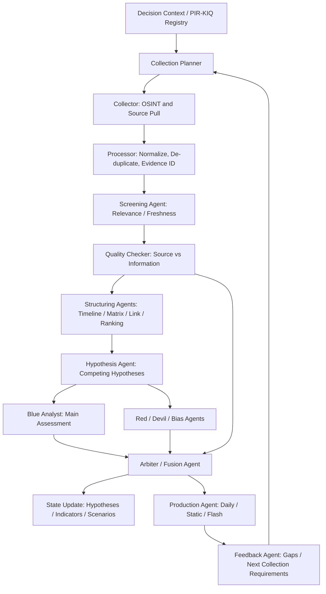
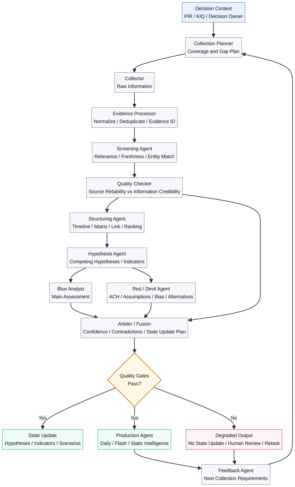

# ビジネス意思決定のためのInformation→Intelligence精査フロー再設計

**Author:** Manus AI  
**対象リポジトリ:** `Ryoji822/I-am-S-2`  
**対象教範:** FM 2-0、ATP 2-22.9、ATP 2-33.4  
**設計方針:** 軍事用途への直訳ではなく、企業・市場・競合・技術動向に関する**正しい意思決定**を支援する情報精査プロセスとしてアナロジー化する。

## 1. エグゼクティブサマリー

現行の `I-am-S-2` は、PIR/KIQ、収集計画、Blue分析、Red Team、Arbiter、Static Intelligence、日次レポート、仮説・シナリオ・指標管理を既に持っており、単なるニュース要約ではなく、意思決定支援型の分析基盤に近い構造を備えている。一方で、3冊の教範を全文解析して突き合わせると、現在のフローは `COLLECT -> ANALYZE -> RED TEAM -> ARBITER -> STATIC UPDATE -> REPORT` に圧縮されすぎており、**InformationをIntelligenceへ変換する前の精査密度**が不足している。[1] [2] [3] [4]

本再設計では、現行のBlue/Red/Arbiter骨格を捨てず、むしろその前後に、収集要求管理、Evidence化、Screening、Source/Information品質評価、構造化分析、ACH、前提検証、確信度校正、配布後フィードバックを独立したAgentic工程として挿入する。OpenCode上では、Agentを「人格」ではなく、**工程責務・入力契約・出力契約・状態更新権限・品質ゲート**で定義する。GitHub Actions上では、日次実行を単一シェル直列実行から、成果物とゲートが明示された段階実行に再構成する。[5]

> **最重要結論:** 収集量を増やすだけではIntelligence品質は上がらない。各Information断片は、PIR/KIQへの関連性、ソース信頼性、情報内容の正確性、独立裏付け、循環報告の有無、反証可能性、既存仮説との関係、確信度への影響を通過して初めて、意思決定に使えるIntelligenceになる。

| 設計観点 | 現行の良い点 | 不十分な点 | 再設計での変更 |
|---|---|---|---|
| 問い駆動 | `pirs.json` と `collection_plan.json` が存在する。 | 収集結果がKIQ充足度へ厳密に戻っていない。 | KIQごとのCoverage Matrix、Gap Register、Retaskingを導入する。 |
| 収集 | Firecrawl等で情報取得できる。 | Raw、Processed、Screenedの境界が弱い。 | Evidence ID、原文保存、正規化、重複排除、取得ログを必須化する。 |
| 品質評価 | Admiraltyコードや確度思想がある。 | Source評価とInformation評価が混ざりやすい。 | Source ReliabilityとInformation Credibilityを分離して評価する。 |
| 分析 | Blue Agentが判断を作る。 | 構造化分析技法の中間成果物が残らない。 | Timeline、Matrix、ACH、Assumptions、Indicatorsを状態化する。 |
| 反証 | Red Teamが存在する。 | Redが後段レビューに偏り、前提・情報品質・代替仮説検査が弱い。 | Devil、Quality、ACH、Bias Checkを独立Agent化する。 |
| 統合 | Arbiterが判断更新を行う。 | 品質ゲート結果を更新条件として強制できていない。 | Arbiterはゲート通過済みの判断だけを状態更新できる。 |
| 配布 | Daily reportとStatic Intelligenceがある。 | 未回答KIQ、低確信度、判断変更理由が出力で薄くなる可能性がある。 | ReportにEvidence、Confidence、Uncertainty、Action、Next IRを必須化する。 |

## 2. Doctrineから抽出したビジネス向け設計原則

FM 2-0は、情報活動を単発の調査ではなく、意思決定者の要求に応じて、収集・分析・配布・評価を循環させる機能として扱う。ATP 2-22.9は、OSINTを「検索して拾う」活動ではなく、計画、収集、処理、評価、報告、記録管理、監督を伴う活動として扱う。ATP 2-33.4は、収集情報をScreen、Analyze、Integrate、Produceの工程でIntelligenceへ変換し、構造化分析技法、反証、品質評価、確信度、分析基準を組み込むことを重視している。[1] [2] [3]

この3冊をビジネスへ置き換えると、以下の原則になる。

| Doctrine原則 | ビジネス情報精査への置換 | 実装上の意味 |
|---|---|---|
| PIR起点 | 事業・投資・競争上の重要意思決定質問を起点にする。 | すべての収集・分析出力に `pir_id` / `kiq_id` を必須化する。 |
| All-source Fusion | 公式、一次資料、専門媒体、SNS、求人、GitHub、規制情報を統合する。 | 単一ソースの要約ではなく、ソース種別の違いを保持して統合する。 |
| Screen before Analyze | 分析前に関連性・信頼性・正確性を評価する。 | Blue Agentに渡す前にScreeningとQuality Gateを通す。 |
| Structured Analytic Techniques | 仮説、前提、証拠、反証を構造化する。 | ACH、Assumption Check、Timeline、Matrixをファイルとして残す。 |
| Confidence with limits | 判断には確信度と限界を付ける。 | High/Moderate/Lowの根拠、未回答、矛盾、仮定を必須化する。 |
| Timeliness | 完璧さより意思決定に間に合うことを重視する。 | Flash、Daily、Periodic、Staticの成果物を分ける。 |
| Feedback / Retasking | 未回答やギャップを次回収集へ戻す。 | `next_collection_requirements.json` を毎回生成する。 |

## 3. 再設計後の全体アーキテクチャ

再設計後のパイプラインは、日次処理の中でInformationを直接レポートに変換しない。まずEvidenceとして保存し、ScreeningとQuality Checkを通過したものだけを分析対象にする。その後、構造化分析を挟んで、Blue/Red/Arbiterの判断更新に接続する。

この構成では、Blue/Red/Arbiterは中心に残るが、Blueに渡す前の段階で「情報として使ってよいか」を判定し、Arbiterに渡す前の段階で「判断として状態更新してよいか」を判定する。これにより、低品質情報や未反証判断がStatic Intelligenceを更新する事故を抑制できる。

## 全体フロー図

## 4. GitHub Actionsの再構成

現行の `daily-intelligence.yml` は、`scripts/run-pipeline.sh` を通じて多くの処理を直列実行している。再設計では、GitHub Actionsは単なる起動装置ではなく、**工程ごとの成果物・ゲート・失敗時ポリシーを管理するオーケストレーター**として使うべきである。[4]

| Job | 目的 | 主な成果物 | 失敗時ポリシー |
|---|---|---|---|
| `prepare-context` | PIR/KIQ、既存状態、前回ギャップを読み込む。 | `run/context/decision_context.json` | 失敗時は全工程停止。問い不明の分析は禁止。 |
| `plan-collection` | KIQ別の収集タスクを生成・優先順位付けする。 | `run/collection_tasks.json`、`coverage_plan.json` | 最低カバレッジ未達なら収集のみ実行し、判断更新は停止。 |
| `collect-information` | OSINT等からRaw情報を取得する。 | `Information/raw/YYYY-MM-DD/*.jsonl` | 収集失敗はKIQ別に記録。前日コピーで判断更新しない。 |
| `process-evidence` | 正規化、重複排除、Evidence ID付与を行う。 | `Information/processed/*.jsonl`、`evidence_index.json` | Evidence化できない情報は分析対象外。 |
| `screen-and-quality` | 関連性、信頼性、正確性、循環報告を評価する。 | `screened_information.json`、`quality_matrix.json` | 重大判断は品質合格情報のみ使用。 |
| `structured-analysis` | Timeline、Matrix、Link、Rankingを作る。 | `analysis_workspace/*.json` | 中間物が空ならBlue/Redを実行しない。 |
| `hypothesis-and-blue` | 競合仮説生成と主判断を作る。 | `hypotheses_draft.json`、`blue_assessment.md` | 代替仮説なしならRedへ進まない。 |
| `red-diagnostic-review` | ACH、Devil、Assumption、Biasを実行する。 | `ach_matrix.json`、`red_findings.md`、`assumptions.json` | 重大反証未解決ならArbiterは保留判断にする。 |
| `arbiter-fusion` | 判断、確信度、状態更新候補を統合する。 | `arbiter_log.json`、`state_update_plan.json` | ゲート未通過のStatic更新を禁止。 |
| `produce-intelligence` | Daily、Flash、Static更新案を作る。 | `reports/*.md`、`static_intelligence/*.md` | レポートは出しても、低品質なら「判断更新なし」と明記。 |
| `validate-and-commit` | スキーマ、参照整合、品質ゲート、監査ログを検証しコミットする。 | `validation_report.md` | 検証失敗時は成果物をartifact保存し、mainへコミットしない。 |

## 5. OpenCode Agentハーネスの再定義

Agentハーネスでは、各Agentの役割を「何を考えるか」ではなく、「どの入力を受け取り、どの中間成果物を生成し、どの状態を更新してよいか」で定義する。特に、同じLLMが複数Agentを担当しても、プロンプト、状態ファイル、出力スキーマ、更新権限を分けることで工程責務を保てる。

| Agent | 入力 | 出力 | 更新可能領域 | 禁止事項 |
|---|---|---|---|---|
| `collection_planner` | `pirs.json`、前回ギャップ、既存状態 | `collection_tasks.json` | 収集計画 | 判断・確信度を作らない。 |
| `collector` | 収集タスク、ソース設定 | Raw Information | `Information/raw` | 要約や判断を混ぜない。 |
| `evidence_processor` | Raw Information | Evidence ID付きprocessed data | `Information/processed`、`evidence_index` | 原文を失う変換をしない。 |
| `screening_agent` | processed data、PIR/KIQ | screened/discarded | `screened_information` | 低関連情報を判断根拠に昇格しない。 |
| `quality_checker` | screened info、source metadata | `quality_matrix.json` | 品質評価 | 有名媒体という理由だけで内容を正しい扱いにしない。 |
| `structuring_agent` | screened + quality passed info | timeline、matrix、link、ranking | `analysis_workspace` | 最終判断を出さない。 |
| `hypothesis_agent` | analysis workspace、既存仮説 | 競合仮説、確認/反証指標 | `hypotheses_draft` | 単一仮説だけで終えない。 |
| `blue_analyst` | 仮説、証拠、品質評価 | 主判断、根拠、行動含意 | `blue_assessment.md` | 反証を無視しない。 |
| `red_devil_agent` | Blue判断、ACH、Assumptions | 反証、代替説明、前提崩壊 | `red_findings.md` | 単なる否定ではなく、証拠に基づく診断を行う。 |
| `arbiter_fusion` | Blue、Red、Quality、State | 最終判断、状態更新案、確信度 | `arbiter_log`、更新候補 | 品質ゲート未通過の判断更新をしない。 |
| `production_agent` | Arbiter出力 | Daily/Static/Flash report | `reports`、`static_intelligence` | 不確実性を隠して読みやすくしない。 |
| `feedback_agent` | 最終判断、未回答、ギャップ | 次回収集要求、監視指標更新案 | `next_collection_requirements` | 新規KIQを人間承認なしに確定しない。 |

## 6. 状態ファイル設計

現在の `hypotheses.json` は継続判断ストアとして有用だが、仮説定義、日次判断履歴、Arbiter所見が混ざりやすい。再設計では、**定義、観測、分析中間物、判断、監査ログ、成果物**を分ける。

| 種別 | 推奨パス | 役割 |
|---|---|---|
| 要件定義 | `config/pirs.json` | 意思決定質問、優先度、オーナー、期限、関連仮説を管理する。 |
| 収集計画 | `config/collection_plan.json` | ソース、頻度、最小ソース数、検索式、許容遅延を管理する。 |
| 実行時収集タスク | `run/YYYY-MM-DD/collection_tasks.json` | 当日実行する具体タスクを保存する。 |
| Raw情報 | `Information/raw/YYYY-MM-DD/*.jsonl` | 取得物を原文・URL・時刻・取得方法付きで保存する。 |
| Evidence Index | `Information/evidence_index.json` | Evidence ID、原文位置、引用可能テキスト、ハッシュを保存する。 |
| Screened情報 | `Intelligence/work/YYYY-MM-DD/screened_information.json` | PIR/KIQ関連性と採否理由を保存する。 |
| Quality Matrix | `Intelligence/work/YYYY-MM-DD/quality_matrix.json` | Source ReliabilityとInformation Credibilityを分離保存する。 |
| 分析中間物 | `Intelligence/work/YYYY-MM-DD/analysis_workspace/*.json` | Timeline、Matrix、ACH、Link、Assumptionsを保存する。 |
| 判断状態 | `config/hypotheses.json`、`config/indicators.json`、`config/scenarios.json` | 継続的な仮説・指標・シナリオ状態を保存する。 |
| 監査ログ | `config/arbiter_log.jsonl` | 判断変更、確信度変更、根拠、反証、承認を追記する。 |
| 成果物 | `reports/`、`static_intelligence/` | 読者向けIntelligenceを保存する。 |

## 7. 品質ゲートの詳細設計

品質ゲートは最終検証だけではなく、各工程の前後に配置する。特に、`validate-output.sh` は表層検査から、スキーマ、参照整合、根拠、確信度、更新条件を検査する`validate-intelligence-contracts`へ拡張する必要がある。

| Gate | 検査対象 | 主要チェック | 失敗時の挙動 |
|---|---|---|---|
| `gate_pir_alignment` | 収集タスク、分析出力 | すべてのタスクと判断に `pir_id` / `kiq_id` がある。 | 該当出力を無効化。 |
| `gate_evidence_integrity` | Evidence Index | URL、取得時刻、引用、ハッシュ、原文参照がある。 | 分析対象外へ移動。 |
| `gate_source_quality` | Quality Matrix | SourceとInformationの評価が分離されている。 | 低品質フラグ付与、重大判断禁止。 |
| `gate_corrob` | 判断根拠 | 独立裏付けがあるか、単一ソース依存を明示している。 | 確信度High禁止。 |
| `gate_fact_assumption_judgment` | Blue/Arbiter/Report | 事実、仮定、判断が分離されている。 | 再整形へ差し戻し。 |
| `gate_hypothesis_competition` | Hypothesis/ACH | 競合仮説、反証証拠、診断性がある。 | Arbiter停止。 |
| `gate_confidence_calibration` | Arbiter | 確信度と根拠条件が整合する。 | 確信度を下げるかHuman Review。 |
| `gate_state_update` | 更新候補 | 変更前後、理由、Evidence ID、反証処理がある。 | 状態更新禁止。 |
| `gate_output_usability` | Report | 判断、根拠、不確実性、行動含意、次回収集がある。 | レポート生成失敗扱い。 |

## 8. ビジネス向け成果物の再定義

成果物は、読者の意思決定タイミングに応じて分ける。すべての成果物で、事実・分析判断・不確実性・推奨アクション・次回収集要求を分離する。

| 成果物 | 目的 | 更新頻度 | 含めるべき内容 |
|---|---|---|---|
| Flash Intelligence | 重大変化の速報 | イベント発生時 | 何が起きたか、未確認点、初期影響、確認すべき次情報。 |
| Daily Intelligence Brief | 日次の意思決定支援 | 毎日 | 新規Evidence、KIQ別回答、判断変更、低確信度の注意点、次アクション。 |
| Static Intelligence | 継続的な企業・市場判断 | 判断変更時 | 長期仮説、根拠、反証、確信度、変化履歴、監視指標。 |
| Weekly/Periodic Review | 仮説・シナリオの見直し | 週次・月次 | シナリオ確率、仮説状態、予測精度、未回答ギャップ。 |
| Collection Gap Report | 次回収集の焦点 | 毎回 | 未回答KIQ、必要なソース、確認条件、優先順位。 |

## 9. 確信度・確率・判断更新のルール

確信度はLLMの主観ではなく、証拠品質と推論品質から決める。ビジネス用途では、High/Moderate/Lowを以下のように運用する。

| 確信度 | 使ってよい意思決定 | 禁止すべき表現 | 必須条件 |
|---|---|---|---|
| High | 重要な戦略判断の根拠にできる。 | 「確実」「断定」は避け、条件を添える。 | 独立複数ソース、重要ギャップなし、反証検討済み、根拠の診断性あり。 |
| Moderate | 方向性判断、監視強化、限定的施策に使える。 | 強い断定や大規模投資判断の単独根拠。 | 主要証拠あり、一部仮定あり、矛盾は限定的、追加収集条件あり。 |
| Low | 注意喚起、仮説生成、次回収集に使う。 | 状態更新、強い推奨、Static Intelligenceの大幅変更。 | 根拠弱いこと、未確認点、次に見るべき情報を明記。 |

判断更新は、`state_update_plan.json` を経由して行う。Arbiterは、`previous_value`、`new_value`、`delta`、`evidence_ids`、`contradictions`、`confidence_reason`、`quality_gate_results` を必ず出し、検証後にのみ `config/hypotheses.json` 等へ反映する。

## 10. 失敗時・劣化時の扱い

現行のように前日コピーやBlue-onlyでレポートを継続すること自体は運用上必要だが、意思決定上の扱いを厳格に分ける必要がある。劣化モードでは、成果物は出しても**判断更新を止める**ことを原則にする。

| 状態 | レポート生成 | 状態更新 | 表示 |
|---|---:|---:|---|
| `GREEN` | 可 | 可 | 通常運用。 |
| `YELLOW_COLLECTION_GAP` | 可 | 条件付き | 収集不足のKIQを明示。High確信度は禁止。 |
| `YELLOW_RED_UNAVAILABLE` | 可 | 軽微更新のみ | Red未実行を明示。重大判断は保留。 |
| `RED_QUALITY_FAIL` | 制限付き | 不可 | 情報品質ゲート失敗。速報・収集ギャップのみ。 |
| `RED_ARBITER_FAIL` | 不可またはartifactのみ | 不可 | 統合判断失敗。mainへコミットしない。 |

## 11. 導入ロードマップ

一度に全体を置き換えるより、現行資産を活かして段階的に導入する方が安全である。

| Phase | 変更 | 目的 | 影響範囲 |
|---:|---|---|---|
| 1 | Evidence IDとraw/processed分離を導入 | 根拠追跡を可能にする。 | Collector、Processor、Report引用。 |
| 2 | Screening/Quality Gateを追加 | 低品質情報の混入を防ぐ。 | Blue前段、Validation。 |
| 3 | ACH/Assumptions/Quality Matrixを状態化 | 反証と前提検証を監査可能にする。 | Red、Arbiter。 |
| 4 | Arbiterのstate_update_plan方式を導入 | 判断更新を安全にする。 | hypotheses、indicators、scenarios。 |
| 5 | GitHub ActionsをJob分割 | 失敗箇所を可視化し、artifact保存を改善する。 | workflow全体。 |
| 6 | Weekly ReviewとForecast Scorecardを追加 | Intelligenceの予測精度を評価する。 | Periodic report、feedback。 |

## 12. 最終的な実装契約

再設計後のAgentic Intelligence Pipelineでは、各日次実行が以下の契約を満たす必要がある。

> **Intelligence Contract:** すべての最終判断は、`pir_id`、`evidence_ids`、`source_quality`、`information_quality`、`facts`、`assumptions`、`judgment`、`alternatives`、`contradictions`、`confidence`、`confidence_reason`、`decision_implication`、`next_collection_requirements` を持たなければならない。

この契約を満たさない出力は、たとえ文章として自然であってもIntelligenceではない。OpenCodeのAgentは、この契約を満たすために分業し、GitHub Actionsは、この契約に違反した成果物をmainへコミットしない役割を担う。

## References

[1]: ARN39259-FM_2-0-000-WEB-2.pdf "FM 2-0 Intelligence"
[2]: atp2-22-9(12).pdf "ATP 2-22.9 Open-Source Intelligence"
[3]: atp2-33-4.pdf "ATP 2-33.4 Intelligence Analysis"
[4]: ./repo_current_state_assessment.md "I-am-S-2 現行パイプライン調査メモ"
[5]: ./business_intelligence_doctrine_kb.md "3冊統合Doctrine知識ベース"
