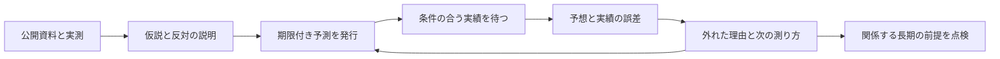

# 仮説を残し、実績で確かめる運用

2026年9月22日版。ニュースを読むだけで終わらず、予想を残し、その後の実績と比べ、次の予想の作り方を直します。

## 何を良くしたいか

社会では生活を支える仕事と所得、会社では顧客と利益、個人では所得と選択肢を見ます。同じ出来事でも三者への影響は違います。対象はまず日本の広告・マーケティング、ソフトウェア開発、管理・顧客対応です。

短期は1〜3か月、中期は3か月超〜1年、長期は1年超〜3年。制度の大きな変化は3〜10年の探索として分けます。短期は週次、中期は月次、長期は四半期、探索は半年ごとに点検します。

精度が毎回上がるとは約束しません。上がったか下がったかを測れるようにし、外れた理由を次の検証へつなぎます。未来の実績がまだない期間は未評価です。

## 仮説と予測を分ける

「AIの利用が増えるほど、会社が提供先を変えにくくなる」は継続して調べる仮説です。「固定した業務で、指定期間の移行費用が基準より30%以上増える」は、条件を揃えれば判定できる予測です。

発行には、対象、地域、母集団、単位、品質基準、比較する基準、閾値、測定期間、期限、公表待ち期限、資料の優先順が必要です。数値・基準・対象が足りない候補は未発行のまま残します。現在の10候補もこの状態です。

見込みは発行版として追記します。確率は二択の命題に0〜1で付け、根拠の厚さ（low/medium/high）とは分けます。定義や期限を変える場合は新しい予測IDと前のIDへの参照を作ります。

## 記録は役割ごとに保存する

| 記録 | 保存するもの |
|---|---|
| Mission / Scenario / CausalLink | 目的、併存する五つの未来、途中の因果。configの小さな定義 |
| Hypothesis / HypothesisReview | 問い、支持・反証となる観測、実際の見直し、別の説明、次の確認 |
| Metric | 地域・母集団・単位・品質を固定した測定定義 |
| Evidence | 原URL、公開・取得時刻、原出所、事実・主張の区別、内容のハッシュ |
| Question / Vintage | 期限付き命題と、発行時の見込み・情報締切・比較用予測・方法の版 |
| Observation / Resolution | 実測とその訂正、判定結果と理由。両方を追記 |
| Review / LinkReview | 外れた原因候補と、根拠がある因果関係だけの見直し |
| Warning / Decision | 警戒と対応時間、行動の費用・条件・戻せるか・結果 |
| RunManifest / UpdatePlan | 実行結果・品質・費用・版、検証する変更案 |

`data/forecast_ledger/transactions/`が正式な追記専用履歴です。一つの変更案を一つのファイルで保存します。試行は`state/shadow/`配下に分けます。設定へ日々の長い分析を追記しません。

レコードの形は`schemas/learning-plan.schema.json`、時刻・参照・意味の検査は`forecast_contract.py`が担当します。schemaだけで根拠の真偽が保証されるわけではありません。反証段階で原資料を照合します。

## 時刻と欠測を混ぜない

公開時刻、取得時刻、予測で使える情報の締切、発行時刻、観測対象期間、判定時刻を分け、タイムゾーンを必須にします。公開済みでも締切後に取得した資料は、その発行版に使えません。初回発行は観測開始より前に限定します。

期間が終わるまではopen、実績の公表待ちはawaiting_data、待ち期限を過ぎても資料が足りなければunresolvableです。資料不足を外れにしません。条件付き予測で前提が成立しない場合はcondition_not_metとし、当たりにも数えません。途中で事象が起きれば確定できるeventと、期間全体を待つperiodを分けます。

統計が訂正されたら、元の実績を残したまま新しいObservationを追加します。初回公表値での採点と最新値での採点を両方表示します。定義に欠陥があればinvalidatedと理由を残します。

## 何を採点するか

二択の予測は `(予測確率 − 実績)²` の平均を使います。実績は成立1、不成立0です。70%と予想して不成立なら0.49。小さいほど誤差が小さく、0件は未評価です。数値・時期の予測は絶対誤差と予測区間内に入った割合を、測定単位を混ぜずに集計します。

最初の発行版を主な成績にし、締切30日前・90日前までの最新発行版は別欄です。方法の版、発行月、測定定義ごとに、同じ実績を使った比較用予測との差を残します。改善の候補を作るのに使った結果と、後から出す予測の結果を分けます。

記事数ではなく独立した出来事の数も表示します。同じ期間・分野で独立した出来事が30件未満なら、確率の調整に使うには不足です。30件以上でも十分な証明とは限らず、自動補正はしません。集計の構成や難しさが違う期間の誤差を、単純な上達のグラフにはしません。

判定不能・無効の割合、未判定件数も残します。現在の集計率の分母は登録済みの全Question（draftを含む）と明記します。採点されたものだけを都合よく抜き出しません。

## 毎朝の流れ

毎日08:00 JSTの起動を維持します。一つの起動内で曜日・月初・四半期初・半年初のレビューを分岐します。

1. 重大な危険、期限、前回の反証、基準不足の順に公開資料を最大20件確認する。
2. 主分析が、仮説の見直しや期限付き予測の案をJSONで作る。
3. 反証担当が元資料、別の説明、条件・時刻・比較の妥当性を点検する。
4. 統合担当が受け入れられた案から選ぶ。ここで新しい判断は作れない。
5. プログラムがすべてを検証し、実績の判定を計算して、一括で追記する。
6. 保存された記録から日報・成績・定期レビューを表示する。

モデルは一時フォルダで動き、渡した公開の文脈だけを読みます。シェル、編集、別エージェントへの委任、外部フォルダは拒否します。出典の本文から指示が見つかっても、検討材料として扱います。原URLの保存前再取得は許可した公開ドメインのHTTPSに限ります。

正式更新の前に、原出所・時刻・対象範囲・変更禁止・採点規則を検査します。一件でも不正なら、その変更案全体を保存しません。古いrevisionを使う更新は拒否し、同じrun ID・同じ内容は二重保存しません。同じIDで別内容も拒否します。ロックと原子的なファイル保存で並行実行を制御します。

収集がpartialなら根拠・実測と決定的な判定だけを保存できます。failed/staleでは新しい判断を保存しません。前日資料のコピー、未反証の主分析の代用、検証失敗後の公開を止めます。警戒は資料不足で下げません。

## 失敗と費用を確認する

`state/runs/<run ID>/manifest.json`でcomplete/partial/failedを見ます。日報ファイルがあるだけで成功と判定しません。失敗メッセージに認証情報を含めず、既存の日報を残します。保存まで成功して表示に失敗した場合はrevision_afterで区別でき、同じaccepted-planから復旧します。

モデルはglm-5.1、OpenCodeは1.18.31、各段階600秒、再試行0回です。最大4段階で、別モデルの報告・Static書き換えは呼びません。モデルの実測費用・トークンは返された範囲で実行記録に残します。金額の上限は未設定（null）で、未計測を無料と表示しません。金額上限を決めるまで厳密な金額停止は有効ではありません。時間・件数・文脈の上限は有効です。

文脈は期限順20予測、種類ごと直近40件を基本に制限します。全履歴は保存されますが、これを超える件数は一度に全件レビューしたとは扱いません。台帳の読み込みは現在全件です。規模が増えた際は、ハッシュで照合できる索引を追加してから件数上限を広げます。

## 試行から正式運用へ

初期設定はshadowです。14日分のcompleteな試行を確認しないとliveへ切り替えられません。試行の目的は保存・再実行・欠測・失敗時の保全を確かめることです。予測精度の証明ではありません。

本番への切替は、結果と費用を見て`config/learning_policy.json`のmodeを変える通常の変更として行います。試行中の予測を過去に遡って正式発行へ変換しません。元の試行履歴は残します。

## 過去の資料と非公開情報

9月15〜21日の日報7本とStatic 7本は9月22日に再編集しました。当時の欠測を埋めたことにはしません。旧設定と旧文書は`archive/pre-learning-2026-09-22/`に元のハッシュとともに保存しました。旧IDは照合に残しますが、定義が揃わない旧確率を採点用に移しません。

Evidence v1の生データ・スキーマ・索引は変更せず保持します。公開時刻がないv1レコードを、新方式の予測根拠へ自動変換しません。原資料を再確認し、v2の時刻・範囲を満たした別記録にします。X投稿も調査の入口として残しますが、投稿だけで実績の判定を作りません。

**過去のInformationを新しい日次処理から検索・自動参照する処理は、今回の変更には含まれていません。** 原本を保持したまま、旧IDとの紐づけ、検索用索引、新形式への変換を追加する必要があります。不明な公開日時を推定で埋めたり、後から取得した資料を過去の発行版へ混ぜたりしません。原本の保存と、過去の蓄積を日々の検証で活用できることは別の進捗として管理します。

このリポジトリは公開資料だけを扱います。自社顧客や個人所得の原本は接続しません。公開する集計は別途許可を得たものに限ります。ローカル実行は通知もgit公開もしません。既存のGitHub日次運用では、検証済みの生成物だけを明示したパスで保存します。全ファイルを一括で追加する処理やSlack送信はありません。
